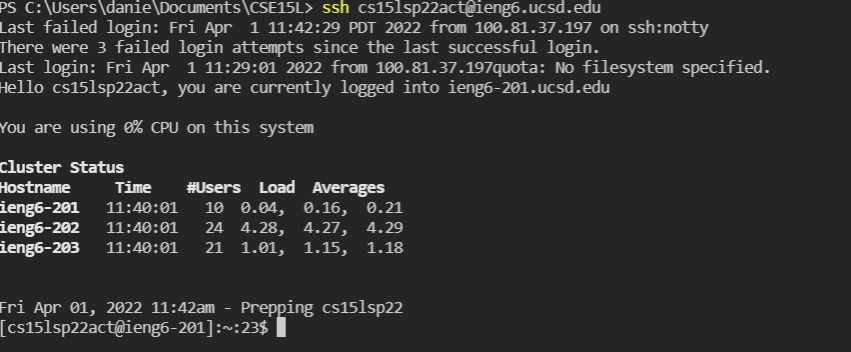

# **Lab Report 1; Week 2**
---
Hello, today I will be showing you how to access the computer on the **IENG6** servers.


## Step 1: Installing **VSC** (Visual Studio Code)

Installing visual studio code is a crucial step to begin your journey into the world of code. VSC contains a terminal which will allow you to input all the commands you need to access and use your account on the IENG6 server

* First you want to install [VSC](https://code.visualstudio.com/Download)
* Make sure you get the right installation that will work with your OS.
* Once you have installed and set up VSC you should have something that looks like the following:


> Congrats you now have Visual Studio Code and are ready to access the terminal.

## Step 2: Connecting to the IENG6 Servers via SSH (Secure Shell)
Once you have everything ready, go to the top of your screen and you should see a button that says "terminal". Create a new termnial by clicking "New Terminal"
> VSC should now look like this:


Do not worry about where your terminal should be or what is shown above (or in my case, to the left) as long as you have the terminal open you are good to go. 

Now you need to ensure that you have OpenSSH installed and you need to know your course specific information. (Personally I didn't have to install OpenSSH, but you might have to if the following steps do not work.)

> Here is the link: [OpenSSH](https://docs.microsoft.com/en-us/windows-server/administration/openssh/openssh_install_firstuse)

Now that you have your course specific information and have OpenSSH installed, you can log onto your IENG6 account via the Secure Shell with the following command:\
`$ ssh cs15lsp22zz@ieng6.ucsd.edu`
* Make sure to replace the zz with the letters provided in YOUR username.

Assuming everything worked out you should have been prompted to type "yes" or "no" and after typing "yes" you will be prompted to enter a password; *however* you will notice that nothing is shown on the screen when you type, this is simply to manimize the risk that someone brute forces your password by knowing its length.

Once you have logged in you should see the following on your terminal:

> Congrats you are now logged in to the IENG6 server computers using the Secure Shell!

## Step 3: Use some commands, get to know the place
Now that you have logged onto the remote computer try running some commands.
Here is a list of commands you can use:
* cd ~
* cd
* ls 
* ls -lat
* pwd 
> There are many more commands but these are some of the basic ones you can use to maneuver around the directories and file spaces.

Here is what running `cd -` and `ls -a` do:


Your result for running `ls -a` may be different

> Good job, now we can move on to slightly more complicated commands.

## Step 4: Copying files with scp
You can copy files from your local machine to the remote computer. 
Try it out!
* to start, first create a new .java file on your computer, lets call it WhereAmI.java
* go ahead and copy the following into your new file:
```
class WhereAmI {
  public static void main(String[] args) {
    System.out.println(System.getProperty("os.name"));
    System.out.println(System.getProperty("user.name"));
    System.out.println(System.getProperty("user.home"));
    System.out.println(System.getProperty("user.dir"));
  }
}
```
* run the program on your computer, this is what will happen:


Now that your new file works on your local computer, lets copy it over to the remote computer and run it on there.
* first, make sure your terminal is open from the directory in which you made the file, in my case this is \CSE15L Code, yours will be different.
* copy the below command, make sure to replace the "zz" with the letters in your username (recall what you did before)\
`scp WhereAmI.java cs15lsp22zz@ieng6.ucsd.edu:~/`
* after typing and running the command, you will be asked to enter your password, like before nothing will show up while you type your password, but rest assured it is being input
* once you have done this, the file should be successfully uploaded the the remote computer, and you should have something that looks like this: 

* now log back onto your remote computer using ssh and your credentials and type ls, you should see your file is now there, it should look like this

* now you can run the javac command and the file will compile and create a new class file, now you should be able to run the java command and the program should run. Here is what it looks like:

> congrats you just uploaded and ran a .java file on the remote computer

## Step 5: Logging in without a password (SSH Key)
Logging in each time and being prompted to input your password can be time consuming and become annoying. The solution? A SSH key that will make the need for a password void.

* Copy the command line below:\
`ssh-keygen`
* DO NOT ENTER A PASSPHRASE WHEN PROMPTED TO, SIMPLY PRESS **"ENTER"**
* This will create 2 new files on your local system, the private and public key (files `id_rsa` and `id_rsa.pub`, repsectively)
* Using what you learned previously, copy the public key onto the remote computer. 
To do this:
* log onto your server account
* type in the below command:\
`mkdir .shh`
* logout of the remote computer using "CTRL - D"
* on your local computer type in this command:\
`scp /Users/<user-name>/.ssh/id_rsa.pub cs15lsp22zz@ieng6.ucsd.edu:~/.ssh/authorized_keys`
* make sure that user-name and the path after /Users/.../ match the location and username that was shown when you created the key before.

> Now you can log in without a password, here is what that looks like

Great now you can log in even faster, but there is more that you can do to log in exponentially faster and use commands faster.

## Enhancing the experience

There are a certain number of things that you can do to enchance your experience when using the remote machines. Below are a list of things you can do.

* use the up arrow key to use previously used commands.
> You can use this to retrieve your login command (the one with ssh) and avoid typing your long username to enter the remote machine.

* using semicolons in one command line can run multiple commands in one line. For example:\
`cp WhereAmI.java OtherMain.java; javac OtherMain.java; java WhereAmI`
> This may help when dealing with a lot more files which may occur once you start to do more work on the remote servers.

* running a command directly on the ssh command to run it as you log in. For example:\
`ssh cs15lsp22zz@ieng6.ucsd.edu "ls"`
> This can enable you to access the remote machines and jump directly into the file that you want, and much more

Here is a screen shot of me using these tools:
> Side Note* I altered my WhereAmI.java file which is why the output is different

---

## Final Regards
Congratulations, you just learned everything I literally just learned last week and still have a very small grasp of. Hopefully this was useful to you, imaginary friend I have been talking to in my head for the past 30 minutes. I wish you good luck on your CSE15L adventure, goodbye
# **:)**