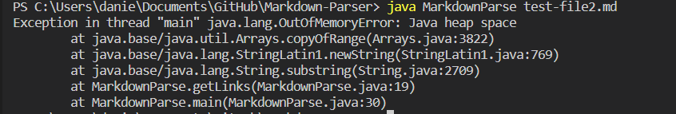
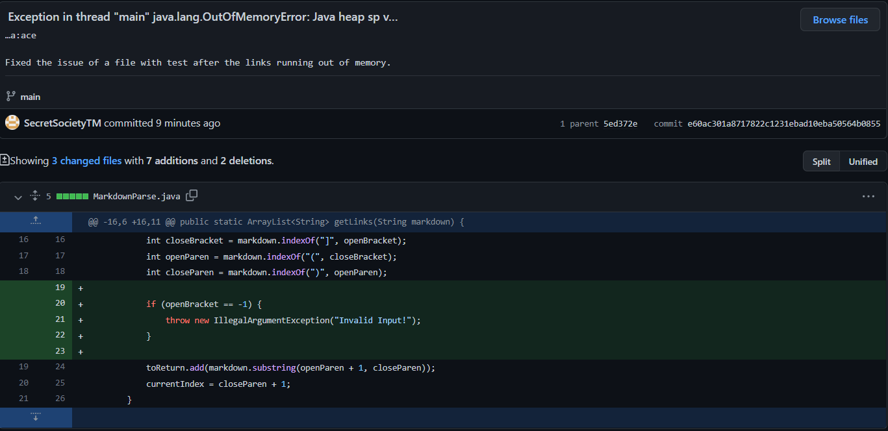
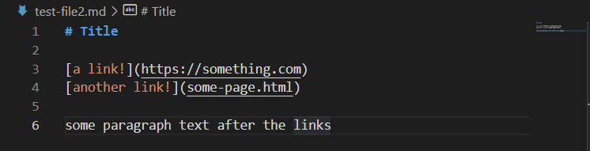
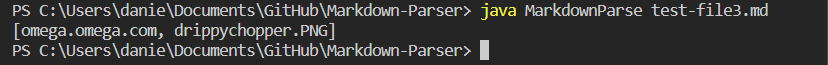
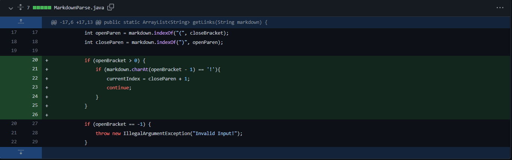
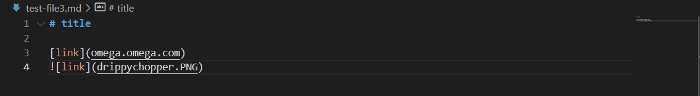
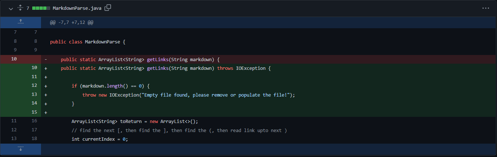
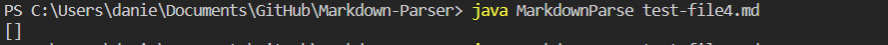
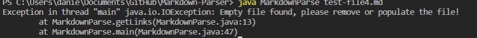

# **Lab Report 2; Week 4**
---
Hello, today I will be going over three instances of trying to touch up MarkdownParse.java to be compatible and functional with mutliple .md files. 

> MarkdownParse.java is a program that takes in a .md file and reads all of the file while taking note of any links that are present and putting them into a list for us to see.

## -THE **FIRST ISSUE**-

The first issue I ran into was having text come after the links, this seemed to cause the while loop in the getLinks() method to continuously run despite all the links being found.

>Here is the error that is produced:

> Here is the code change diff from GitHub

Simply checking if openBracket was equal to -1 and returning an IllegalArgumentException fixed this issue; although in hindsight it would probably better if I figured out a way to still grab the links even if there is text after the links...

**HOWEVER** here is the link to the [test-file](https://github.com/SecretSocietyTM/Markdown-Parser/blob/main/test-file2.md) that caused this issue.

## -THE **FIRST SYMPTOM**-
**AND ITS SOLUTION**

The symptom of the MarkdownParse.java program not being able to handle the contents of test-file2.md were the following:
* Java heap space

What this means is that the method getLinks() does not have something built in to shutdown the while loop if the end of the file is detected.

In this case, the while loop in getLinks() will only end if a link is the last thing on the test-file since the currentIndex variable is only updated after the closed paretheis has been found.

As you can see in test-file2.md 

The last closed parenthesis is leagues away from being the last character in the test-file, therefore the while loop is updated that last time and never again, so it keeps running and running until eventually my computer runs out of memory and **EXPLODES**

In this case, the bug was located in the getLinks() while loop, the symptom was the `Java heap space` error, and the input was the file test-file2.md.

## -THE **SECOND ISSUE**-

Next I wanted to try to solve the issue of having an image link, now the method in MarkdownParse.java is called getLinks() not getImageLinks() so naturally I would want to avoid adding any image links to my list of links; however there were problems...

>One of these links is not like the other...

As you can see (hopefully) one of the "links" is actually a .PNG file, here is the file in question:

> This is Chopper's best outfit, no cap

The fix for this was very simple, but before I get to that, here is the code change diff from GitHub

A simple fix, just need to check if the character before any open brackets is a "!", if it is then the while loop skips anything that would have happened after the if statement.

Here is the link to the [test-file](https://github.com/SecretSocietyTM/Markdown-Parser/blob/main/test-file3.md) that causes this issue.

## -THE **SECOND SYMPTOM**-
**AND ITS SOLUTION**

The symptom for this issue was not caused by an error in compiling or running the program, rather it is a minor bug that should not be allowed. 
* Image links should not be appended to my list of links

The while loop in getLinks() did not have anything in place to avoid adding image links to the list, so in order to fix this, I simply added an if statement (two actually) that checks if there are any "!" before the open bracket that would otherwise signify the start of a link. 

As you can see in test-file3.md

there is a ! before the open bracket.

In this case, the bug was located in getLinks() logic since it counted an image link as a link and added it to the list, the symptom was the image link that was printed when the program is run, and the input was the file test-file3.md

## -THE **THIRD ISSUE**-

I figured the next easiest possible error to solve would be if an empty file is fed into getLinks() paremeter. So I created a new .md file with nothing in it. 

When the code is ran on an empty file, an empty list is returned, like this `[]`, but I want the user to be notified that they have an empty .md file and should either remove it, or do whatever, so instead of returning an empty list I want to send an exception message.

Here is the code change diff from GitHub

Here is the link to the [test-file](https://github.com/SecretSocietyTM/Markdown-Parser/blob/main/test-file4.md) that causes this issue.

## -THE **THIRD SYMPTOM**- 
**AND ITS SOLUTION**

The symptom for this issue was similar to that of the image link, in the sense that it did compile and ran, just the output is not what I wanted.
* If a file is empty, notify the user of it

The fix for this issue was rather simple, just check if the contents of the file which has been converted to a String is 0, if it is then an IOException is thrown notifying the user of said issue.

test-file4.md is quite literally empty so there is no need to show a picture of what is going on in that file.

In this final case, the bug was located in getLinks() logic, again, rather than returning an empty list upon being fed an empty .md file, I wanted to notify the user running the program that the file was empty

 and that it should be removed or something should be added (not necessarily a link). The symptom was an empty list ( [] ) being printed instead of an error message, and the input that caused the error was the file test-file4.md.

## Congrats you made it to the end of my redundant and super late Lab Report 2.

I was not feeling so well from week 3 ish to whatever week I am submitting this on so I ended up just giving up on a lot of school work stuff but hopefully from this week on I come back better and in a healthier mind set. Thank you, and sorry to whoever has to grade this :)

