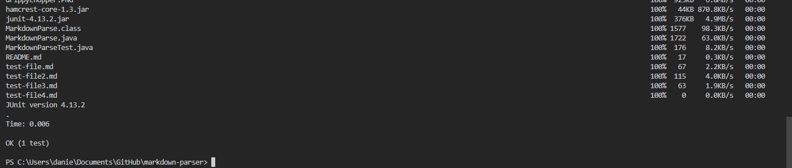

# **Lab Report 4; Week 6**
---

Hello, today I will be showing you the process that I used to implement the three Group Choice Options including:
* **Streamlining ssh Configuration (Short Username)**
* **Setting Up GitHUb Access from ieng6**
* **Copying Whole Directories Using `scp -r`**

---

## **CHAPTER 1:** Streamlining ssh Configuration (Short Username)

Setting up a custom alias or username will allow a user to login to their ieng6 account without having to type `ssh cs15lsp22zzz@ieng6.ucsd.edu`. The the custom alias, when combined with the ssh key makes logging in to the ieng6 servers so much easier, and a lot faster. **Lets get started.**

Assuming you have already set up the ssh key, open up the .ssh folder located on your personal computer onto Visual Studio Code.


Once open, you should have the following files in your folder:


Next, simply create a new file, make sure to call it `config`

once you have created the file, copy and paste the following lines

```
Host ieng6
    HostName ieng6.ucsd.edu
    User cs15lsp22zzz (use your username)
```

You can change the `ieng6` after Host to whatever you want your login name to be. Here is how my file looks after I have made the changes. 


And you are all set, now test it out in the terminal! Here is what a successful login should look like. 


Once you are in your account you can go about your day as normal, here is a screen shot of me copying a cool picture onto my ieng6 server account using my new login alias. 


As you can see after logging in and running the `ls` command the file I copied (drippychopper.PNG) is now there.

Here is the file in question: 


Pretty cool huh?

---

## **CHAPTER 2:** Setting Up GitHUb Access from ieng6

***Was not able to get GitHub ssh token thing to work unfortunately***

---

## **CHAPTER 3:** Copying Whole Directories Using `scp -r`

Its not very difficult to copy an entire directory from your computer, in this example I will be showing you that I copied my markdown-parse directory found on my GitHub folder on my computer to my ieng6 account.

Here are the files being copied


And here is proof that the entire directory is now on my ieng6 account


Once markdown-parse is on the ieng6 account, I am able to compile and run it like I would on my local machine. Here is what that looks like:


Wow, the singular test I had on the MarkdownParseTest.java file ran, what a relief.

Those were the basics of copying and running directories/ repositories from your computer to the ieng6 account. 

A more streamlined way to copy and run the files to check that everything works can be achieved by combining the 2 commands into one command.

Here is the singular command I used to copy, access the directory of, and run the MarkdownParseTest.java file:
* `scp -r . secretSoc:~/markdown-parsev2; ssh secretSoc "cd markdown-parsev2; javac -cp .:lib/junitseTest.java; java -cp .:lib/junit-4.13.2.jar:lib/hamcrest-core-1.3.jar org.junit.runner.JUnitCore MarkdownParseTest"`

Its very long, but as I mentioned earlier, it consists of copying (the scp) the directory, logging into my ieng6 account (the ssh), accessing the right directory (the cd markdown-parsev2), and compiling and running (the javac and java).

Here is what that looks like:




Very Cool!!!!!

---
## **CLOSING MESSAGE** (Not Important to Lab Report)
Learning to use UNIX commands and doing all these interesting things is fun; however I tend to forget half of the stuff we learn in class because I don't personally use it too often, but learning more of these things that streamline the ssh use or make using the ieng6 server's more like using my local computer and GitHub allows me to practice a bit. Unforunataly I was not able to get the ssh to work with GitHub to allow me to use the git push command, but hopefully I can get this fixed :)


