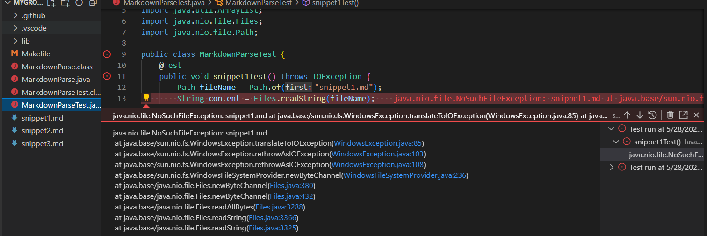
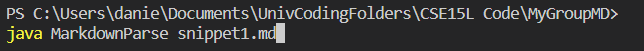
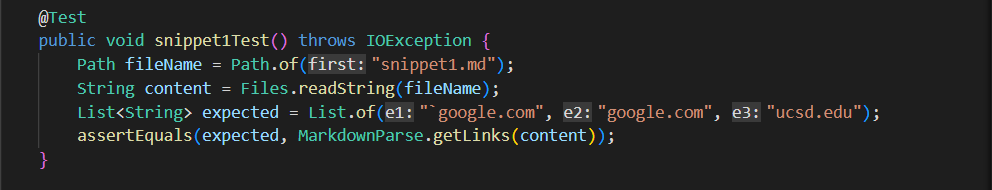
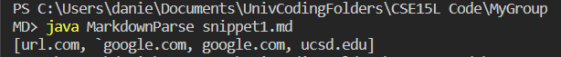
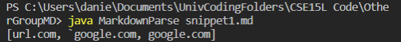
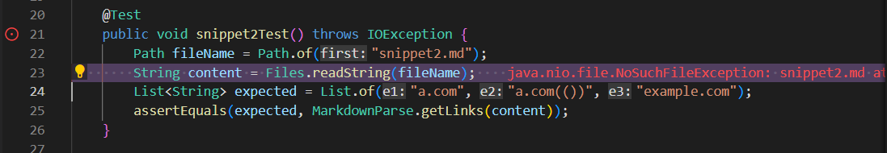
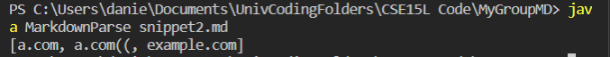
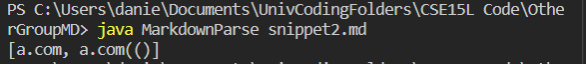
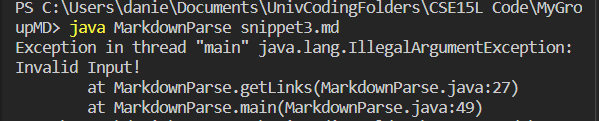
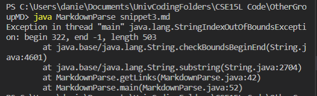

# **Lab Report 2; Week 4**

---

Hello, today I will be running some tests on both my group's Markdown Parser, and another group's Markdown Parser.

## **INTRODUCTION**

Before I begin, I need to explain that I was unable to compile and run the test file on either repository. I would continuously get errors like "cannont find symbol" when trying to compile using the `javac -cp .:lib/junit-4.13.2.jar:lib/hamcrest-core-1.3.jar MarkdownParseTest.java` command. And when I tried to run the test by pressing the play button I would get this error:

so instead I will be relying on the [commonmark.js](https://spec.commonmark.org/dingus/) website to help me see which links work, and I will be running the program using `java MarkdownParse` + the file name, like so: 

---

## **THE REPOSITORIES**

Here is the link to the repository my group shared during Lab 7.

[Our Repository](https://github.com/httrieu/markdown-parser)

Here is the link to the repository that was shared with my group.

[Lab 7 Reviewed Repository](https://github.com/aaronchan32/markdown-parser)

## **TEST 1: snippet1.md**

Starting with the snippete1.md file, the output that I expect is the following:

* [`google.com, google.com, ucsd.edu]

And here is the code I wrote for the test:

**Below are the results of running MarkdownParse with snippet1.md**

                    MY GROUP'S RESULTS

 

In this case, the JUNIT expected input would not include `url.com`

                    OTHER GROUP'S RESULTS

Again, the output was incorrect, the other group's results included `url.com`

url.com should not be included as the brackets are broken up by the backticks. However the same cannot be applied to [`code]`](ucsd.edu) as the brackets surround the text.

## **TEST 2: snippet2.md**

Next, I will test the snippet2.md file. Here is the expected output and the code written for the test:

* [a.com, a.com(()), example.com]

**Below are the results of running MarkdownParse with snippet2.md**

                    MY GROUP'S RESULTS

 

                    OTHER GROUP'S RESULTS

My goup's program was unable to include all of the a.com(()) link. The other group's program was also unable to get all of the a.com(()) link, but it was unable to retrieve the example.com link.

## **TEST 3: snippet3.md**

Finally, I will test the snippet3.md file. Here is the expected output and code for the test:

* [https://sites.google.com/eng.ucsd.edu/cse-15l-spring-2022/schedule]

**Below are the results of running MarkdownParse with snippet3.md**

                    MY GROUP'S RESULTS

 

                    OTHER GROUP'S RESULTS

Both my group, and the group who shared their repository with us was unable to produce a link. My group's repository threw an exception, which was a feature of our program, to throw an exception when given an invalid first link. The other group's program had a regular out of bounds exception.

## **QUESTIONS, AND ANSWERS**

**FIX FOR SNIPPET1.md**

I think it would be possible to solve the issue with less than 10 lines of code. MarkdownParse.java could be edited so that it checks possible links for other special characters like the backticks or exclamation marks
that come before or after, or are located where the link would not function as a link anymore.

**FIX FOR SNIPPET2.md**

Again, I think that the issues stemming from snippet2.md can be solved with less than 10 lines of code. The code could check for only one set of open and closed brackets. If the open and closed brackets contain more open or closed brackets in them, they will be ignored. Similarly, the parenthesis can be accounted for similar to how the brackets are, checking for a set of open and closed parenthesis, and ignoring any that might be within the initally detected open and closed parenthesis. This could be done by continuing to check each character until a new line is found or a space that come after.

**FIX FOR SNIPPET3.md**

I think that a change less than 10 lines of code could be made to the MarkdownParse.java program to resolve the issue of links being broken up by newlines. When checking for the next closed parenthesis or the closed bracket, there could be some lines of code that will also check for a newline and continue to save the links title and the actual link. 

